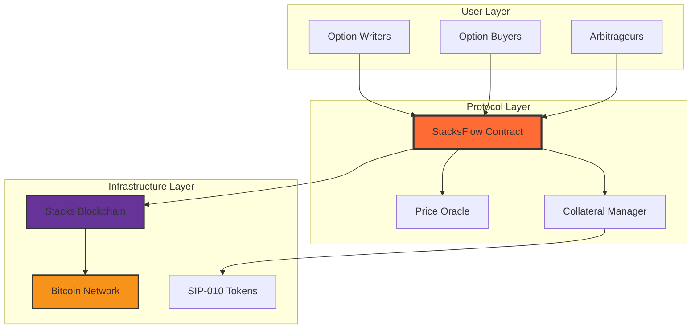
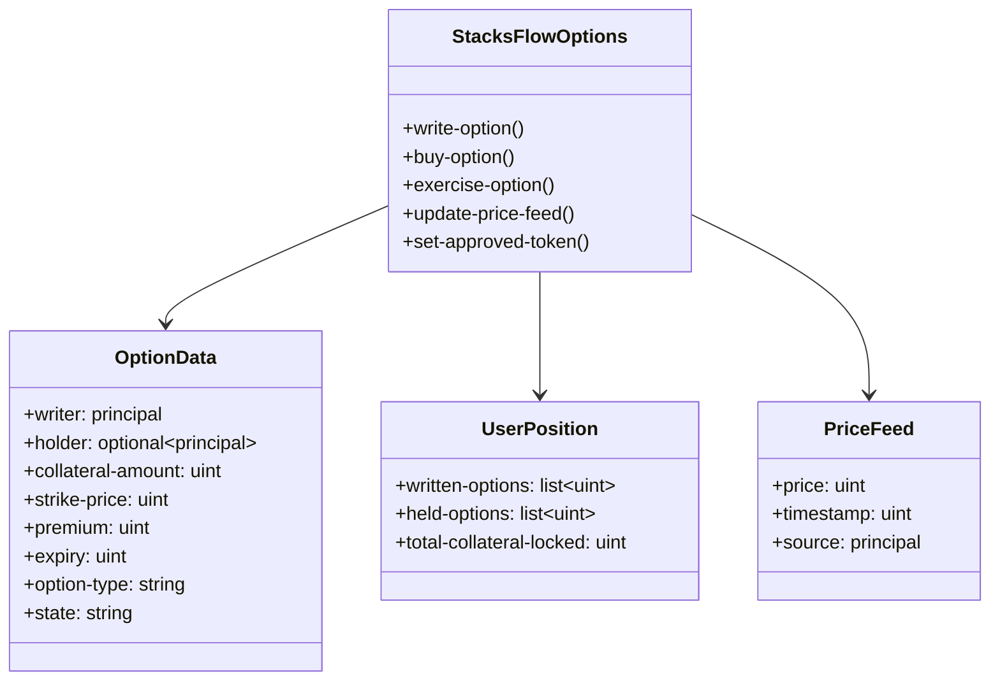
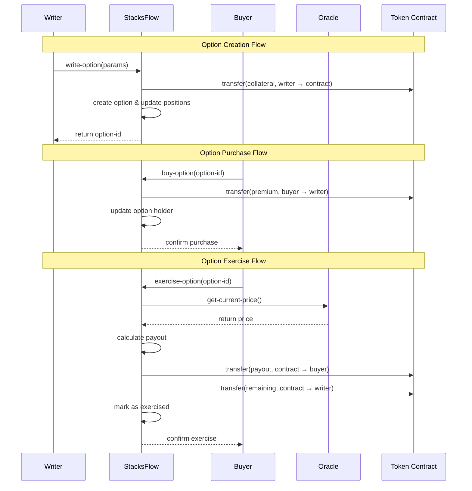

# StacksFlow Options Protocol

> **Decentralized Bitcoin-backed Options Trading on Stacks Layer 2**

StacksFlow is a cutting-edge decentralized options trading protocol built on the Stacks blockchain, enabling trustless creation, trading, and settlement of Bitcoin-backed derivatives. By leveraging Stacks' unique ability to interact with Bitcoin, StacksFlow provides secure, transparent, and automated options trading with native Bitcoin integration.

## 🌟 Key Features

- **🟠 Native Bitcoin Integration** - Direct Bitcoin interaction through Stacks Layer 2
- **🔒 Trustless Settlement** - Automated exercise and collateral management
- **📊 Oracle-Based Pricing** - Real-time price feeds for accurate settlements
- **💰 Multi-Collateral Support** - SIP-010 token standard compatibility
- **⚡ Gas Efficient** - Optimized for Stacks blockchain performance
- **🛡️ Risk Management** - Built-in collateral validation and safety checks
- **🏛️ Decentralized Governance** - Community-driven protocol parameters

## 🏗️ System Architecture



## 🔧 Contract Architecture

### Core Components



### Data Flow Architecture



## 📋 System Overview

### Option Lifecycle

1. **Creation Phase**
   - Writers lock collateral tokens
   - Set strike price, premium, and expiry
   - Option becomes available for purchase

2. **Trading Phase**
   - Buyers pay premium to acquire options
   - Ownership transfers from writer to buyer
   - Position tracking updates automatically

3. **Settlement Phase**
   - Options can be exercised before expiry
   - Profit calculated against current market price
   - Automated payout and collateral release

### Risk Management

- **Collateral Requirements**: Dynamic based on option type and market conditions
- **Price Oracle Integration**: Real-time pricing for accurate settlements
- **Expiry Management**: Automatic expiration handling
- **Token Whitelisting**: Only approved tokens accepted as collateral

## 🚀 Quick Start

### Prerequisites

- Stacks wallet (Hiro, Xverse, etc.)
- SIP-010 compatible tokens for collateral
- Basic understanding of options trading

### Contract Deployment

```bash
# Clone repository
git clone https://github.com/shalom-png/stacksflow-options.git
cd stacksflow-options

# Deploy to testnet
clarinet deploy --network testnet

# Deploy to mainnet
clarinet deploy --network mainnet
```

### Basic Usage

#### Writing an Option

```clarity
;; Create a CALL option
(contract-call? .stacksflow-options write-option
  .wrapped-btc        ;; collateral token
  u100000000         ;; collateral amount (1 BTC)
  u50000000000       ;; strike price ($50,000)
  u1000000           ;; premium (0.01 BTC)
  u144000            ;; expiry (1000 blocks)
  "CALL"             ;; option type
)
```

#### Buying an Option

```clarity
;; Purchase option with ID 1
(contract-call? .stacksflow-options buy-option
  .wrapped-btc       ;; payment token
  u1                 ;; option ID
)
```

#### Exercising an Option

```clarity
;; Exercise option if profitable
(contract-call? .stacksflow-options exercise-option
  .wrapped-btc       ;; payout token
  u1                 ;; option ID
)
```

## 📊 Protocol Specifications

### Supported Option Types

| Type | Description | Collateral | Exercise Condition |
|------|-------------|------------|-------------------|
| CALL | Right to buy | Strike price amount | Current price > Strike |
| PUT | Right to sell | Market value equivalent | Strike > Current price |

### Fee Structure

- **Protocol Fee**: 1% (100 basis points) - adjustable by governance
- **Gas Costs**: Standard Stacks transaction fees
- **Oracle Fees**: Included in protocol operations

### Security Features

- **Multi-signature governance** for critical updates
- **Time-locked parameter changes** for transparency
- **Circuit breakers** for emergency situations
- **Comprehensive input validation** at all levels

## 🛠️ Development

### Testing

```bash
# Run unit tests
clarinet test

# Run integration tests
clarinet test --coverage

# Check contract analysis
clarinet check
```

### Contributing

1. Fork the repository
2. Create feature branch (`git checkout -b feature/amazing-feature`)
3. Commit changes (`git commit -m 'Add amazing feature'`)
4. Push to branch (`git push origin feature/amazing-feature`)
5. Open Pull Request
